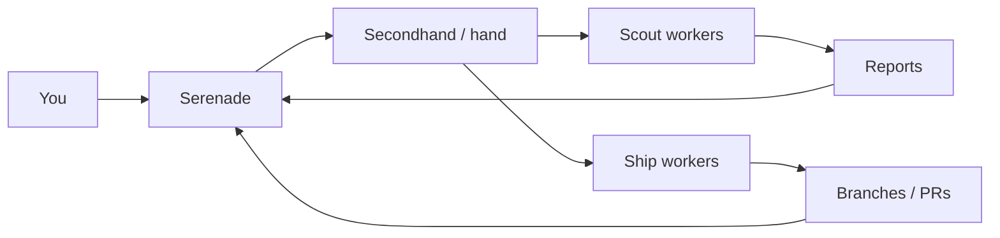

<p align="center">
  
</p>

<h1 align="center">Serenade</h1>

<p align="center"><strong>A control room for your AI software team.</strong></p>

<p align="center">
  <a href="LICENSE"></a>
  
  
</p>

Serenade is a free, local-first desktop GUI for [Secondhand (`hand`)](https://github.com/atqamz/hand), the multi-agent coding orchestrator. If you run several AI coding agents in parallel, `hand` orchestrates them; **Serenade makes the fleet visible, controllable, and steerable without keeping a pile of terminals open.**

> Serenade sits on top of `hand`; it does not reimplement the orchestration engine. `hand` remains the source of truth for every task, worker attempt, route, and worktree.



## Why Serenade?

Running a fleet of coding agents from a CLI is powerful, but operationally expensive. Serenade answers the questions you keep asking while several workers are active:

- **What are my agents doing right now?**
- **Which tasks are blocked, stale, or failed?**
- **What changed, and where is the worktree?**
- **What did the scout discover?**
- **What needs my attention?**

It also adds a **Supervisor chat** that can inspect fleet state, plan work, and propose tasks as approval cards. The supervisor never bypasses the operator: you approve every spawn.

## Features

### Fleet operations

| Area | What you get |
|---|---|
| **Overview** | Fleet health, live activity, project health, provider usage, failures, stale-worker warnings |
| **Projects** | Registered repositories with a Kanban board, timeline, search, and filters |
| **Tasks** | Worker log stream, progress, worktree + Git status, commits, scout report, retry / stop / instruct / promote actions |
| **Agents** | Every worker attempt with harness, model, live agent state, and heartbeat warnings |
| **Worktrees** | Isolated checkouts per task with Git metadata; open in editor / file manager / terminal; confirmed cleanup |
| **Reports** | Markdown rendering of scout reports; create follow-up work; promote scouts to ship tasks |
| **Routes & providers** | Read-only view of Hand profiles/routes plus live worker counts |
| **Supervisor chat** | AI supervisor with fleet context and one-click task approval cards |

### Built-in safety

- **No arbitrary shell endpoint** — backend actions are fixed, typed operations rather than a generic command runner.
- **Destructive actions are confirmed** — teardown and worktree cleanup show what will happen before execution.
- **Human-gated dispatch** — the supervisor can propose work, but only the operator can approve a spawn.
- **Local-first application state** — Serenade has no hosted backend or telemetry service. Your configured AI harnesses may still communicate with their own model providers.

### Developer experience

- `Ctrl+K` command palette and global search.
- Resizable context panel for inspecting tasks without leaving the board.
- Shared polling cache to avoid spawning redundant `hand` processes.
- Browser mock mode for frontend work without a live fleet.
- Dark developer-tool UI with dense operational views and monospace identifiers.

## Requirements

| Tool | Why |
|---|---|
| [Node.js](https://nodejs.org) 22+ | Frontend toolchain |
| [Rust](https://rustup.rs) | Tauri desktop build |
| [Git](https://git-scm.com) | Project clones and worktree metadata |
| [Secondhand (`hand`)](https://github.com/atqamz/hand) 0.6.0+ | Fleet orchestration and task lifecycle |
| At least one Hand-supported coding harness | Worker execution through Hand profiles/routes |
| [OpenCode](https://opencode.ai) | **Currently required only for Serenade Supervisor chat** |

### Install Secondhand

The recommended path is Secondhand's documented bootstrap, which installs `hand` and its runtime dependencies.

Linux / macOS:

```sh
curl -fsSL https://github.com/atqamz/hand/releases/latest/download/bootstrap.sh | sh
```

Windows PowerShell:

```powershell
irm https://github.com/atqamz/hand/releases/latest/download/bootstrap.ps1 | iex
```

Then verify the environment:

```sh
hand doctor
```

See the [Secondhand repository](https://github.com/atqamz/hand) for manual and platform-specific installation options.

## Getting started

### 1. Clone and launch Serenade

```sh
git clone https://github.com/BigNeekode/Serenade.git
cd Serenade
npm install
npx tauri dev
```

For a production build:

```sh
npx tauri build
```

Tauri places release artifacts under `src-tauri/target/release/` and platform bundles under `src-tauri/target/release/bundle/` when bundle generation is available for the host platform.

On first launch, Serenade validates the configured `hand` binary and fleet path and shows setup guidance when something is missing.

### 2. Create or select a fleet home

A *fleet home* is the directory created by `hand init`. Serenade can initialize one from its setup screen, or you can create it yourself:

```sh
hand init ~/secondhand-fleet
hand doctor
```

Then set that directory in **Serenade → Settings → Fleet path** and save the configuration.

### 3. Register a project

```sh
hand project add https://github.com/you/your-repo
```

You can confirm the fleet configuration with:

```sh
hand config
```

### 4. Configure Hand profiles and routes

Hand 0.6.x does **not** use one global `hand config set harness ...` setting. Worker selection is expressed through **profiles** and **routes**.

The supported CLI shape is:

```sh
hand config profile set <profile-name> --harness <installed-harness> [--model <model>] [--effort <effort>]
hand config route set <scout|ship> <mechanical|standard|deep> <profile-name>
hand config
```

Profile names, models, and routing policy are operator-owned choices. A normal Secondhand supervising session can inspect `hand config`, ask only for unresolved policy choices, and persist the selected profiles/routes for you.

Serenade reads that configuration; it does not invent a replacement routing policy.

### 5. Create your first task

There are two paths:

- **Direct** — click **New Task**, select a project, enter the task brief, then choose **scout** (investigation/report) or **ship** (implementation). Serenade writes the brief and dispatches the worker through `hand spawn`.
- **Supervisor** — open **Supervisor**, describe the outcome you want, and let the supervisor propose tasks. Approved cards are written as task briefs and spawned through Hand.

From there you can watch the board, inspect logs, send mid-flight instructions, review the worktree, retry failed attempts, promote scout work, and clean up completed tasks.

## Supervisor chat

Serenade's current Supervisor implementation launches **OpenCode headlessly** and supplies it with Hand's supervisor session contract plus live fleet state.

This is separate from worker routing:

- Worker tasks may use any installed harness that Hand supports and that you configure through profiles/routes.
- **Serenade Supervisor chat currently requires `opencode` on `PATH`.**

If OpenCode is missing, the rest of Serenade remains usable; only Supervisor chat is unavailable.

## How it works

```text
┌────────────────────────────  Serenade (Tauri desktop app)  ─────────────────────┐
│                                                                                  │
│  React UI  ── TanStack Query (polling + cache) ── typed SerenadeApi             │
│                                                        │                         │
│  Rust backend ────────────────────────────────────────┘                          │
│   ├─ hand adapter: fixed-argument subprocess calls, HAND_HOME, timeouts          │
│   ├─ fleet files: briefs, reports, worker status streams, event log              │
│   ├─ git adapter: read-only worktree metadata                                    │
│   └─ supervisor: headless OpenCode session with Hand supervisor context          │
└────────────────────────────────────────┬─────────────────────────────────────────┘
                                         │
                              Secondhand / hand CLI
                                         │
                    treehouse · herdr · configured worker harnesses
                                         │
                         project clones + isolated worktrees
```

Key principles:

- **`hand` is the source of truth.** Serenade reads `hand status --json`, `hand project list --json`, `hand config`, and fleet files.
- **Mutations are real Hand operations.** Spawn, send, reopen, promote, and teardown map to their corresponding CLI operations.
- **The frontend never needs CLI syntax.** Tauri exposes typed application commands rather than a generic shell bridge.
- **Mock mode is built in.** `npm run dev` runs the frontend against a rich in-memory fleet without requiring a live Secondhand installation.

## Repository layout

```text
src/                  React frontend
├─ app/               bootstrap, router, providers
├─ components/        design system, app shell, common UI
├─ features/          overview, supervisor, projects, tasks, agents, worktrees,
│                     reports, routes, settings, setup
├─ hooks/             query hooks and polling
├─ lib/api/           SerenadeApi interface + Mock and Tauri implementations
├─ state/             UI state
└─ types/             shared domain model

src-tauri/src/        Rust backend
├─ lib.rs             Tauri commands and application integration
├─ hand/              process wrapper, JSON models, TOON parser
├─ supervisor.rs      headless Supervisor sessions
├─ adapter.rs         Hand lifecycle → UI domain mapping
├─ fleet_files.rs     briefs, reports, status streams, event log
├─ git.rs, local.rs   Git metadata and local editor/folder/terminal launching
└─ config.rs, error.rs, domain.rs

docs/                 product design, architecture, implementation plan,
                      backlog, and verified Hand integration notes
```

## Development

```sh
npm run dev                        # frontend only, mock backend → localhost:1420
npx tauri dev                      # full desktop app against a real fleet
npm run test                       # Vitest + React Testing Library
npm run lint                       # ESLint
npm run typecheck                  # TypeScript
cd src-tauri && cargo test         # Rust unit tests
```

The `docs/` directory contains the deeper engineering material:

- [`docs/design.md`](docs/design.md) — product and UX design.
- [`docs/architecture.md`](docs/architecture.md) — system architecture and safety model.
- [`docs/implementation-plan.md`](docs/implementation-plan.md) — milestone plan.
- [`docs/hand-integration-notes.md`](docs/hand-integration-notes.md) — verified Hand CLI/runtime contract.
- [`docs/tasks.md`](docs/tasks.md) — implementation backlog and status.

## Troubleshooting

### Worker spawn fails with `server_not_running`

The `herdr` server is not running. Start it and retry the task.

```sh
herdr
```

### Worker spawn hangs at a `>>` prompt on Windows

Hand worker panes require a POSIX-compatible shell. Configure Git Bash for herdr in `%APPDATA%\herdr\config.toml`:

```toml
[terminal]
default_shell = "C:\\Program Files\\Git\\bin\\bash.exe"
```

Then reload herdr:

```sh
herdr server reload-config
```

See [`docs/hand-integration-notes.md`](docs/hand-integration-notes.md) for the verified Windows notes.

### Claude worker pauses on a trust/security dialog

Claude Code can ask whether to allow external `CLAUDE.md` imports. Answer the prompt once in the herdr pane, or route that work through another already-configured Hand profile.

### Supervisor chat says `opencode` is not found

Install OpenCode and ensure the `opencode` executable is on `PATH`. This requirement applies to Serenade's Supervisor chat, not to all worker routes.

### Task looks active after the coding agent finished

Some harness behavior can leave Hand without the expected final report line. Serenade surfaces the resulting state so you can inspect the worktree, send another instruction, or tear the task down deliberately.

## Status and roadmap

**MVP complete and live-verified against Hand 0.6.0 on Windows.** Core fleet views, task lifecycle operations, worktrees, reports, and Supervisor proposals have been exercised against a real fleet.

Next areas:

- Installer bundles and finalized application branding/icons.
- `hand watch --until-event` as a push-style event source where appropriate.
- Streaming Supervisor replies.
- Safe profile/route editing in Serenade.
- Token and cost analytics where the underlying harness data is available.

See [`docs/tasks.md`](docs/tasks.md) for the detailed backlog.

## Contributing

Issues and pull requests are welcome. For implementation work, start with the architecture and Hand integration notes so changes preserve the core invariants: Hand remains the source of truth, destructive actions stay explicit, and Serenade does not expose arbitrary shell execution.

## Acknowledgments

- [Secondhand / `hand`](https://github.com/atqamz/hand) — the orchestration engine Serenade controls.
- [treehouse](https://github.com/kunchenguid/treehouse) and [herdr](https://herdr.dev) — worktree pooling and worker-pane supervision used by Hand.
- [Tauri](https://tauri.app), React, Tailwind CSS, TanStack Query, and the broader open-source ecosystem behind the desktop UI.

## License

Licensed under the [MIT License](LICENSE).
