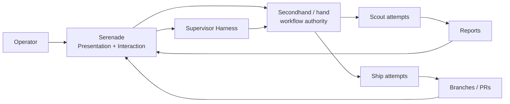

<p align="center">
  
</p>

<h1 align="center">Serenade</h1>

<p align="center"><strong>A control room for your AI software team.</strong></p>

<p align="center">
  <a href="LICENSE"></a>
  <a href="https://github.com/BigNeekode/Serenade/actions/workflows/ci.yml"></a>
  
  
</p>

Serenade is a free, local-first desktop interface for [Secondhand (`hand`)](https://github.com/atqamz/hand), the multi-agent coding orchestrator. Hand owns the fleet and worker lifecycle; **Serenade makes that fleet visible, controllable, steerable, and much easier to set up.**

> Serenade is the **Presentation + Interaction layer** above Hand. It does not replace Hand's orchestration, lifecycle, routing, session, or worktree authority.



## What Serenade gives you

| Area | What you get |
|---|---|
| **Quick Setup** | First-run environment scan, managed Hand install, Treehouse/Herdr setup, Fleet initialization, optional Supervisor detection, and first-project registration |
| **Environment repair** | Rescan, per-tool install/reinstall, and one-click **Repair automatically** when a previously working environment becomes incomplete |
| **Overview** | Fleet health, live activity, project health, provider usage, failures, and clearly labeled legacy-derived Attention hints |
| **Projects** | Registered repositories, Kanban/timeline views, search/filtering, and remote Git URL registration |
| **Tasks** | Worker stream, progress, Git/worktree state, commits, reports, retry/stop/instruct/promote actions, and progressive Task → Plan → Attempt lineage |
| **Agents** | Worker attempts with harness/model, observed activity, lifecycle-aware presentation, and heartbeat warnings |
| **Worktrees** | Isolated checkouts with Git metadata; open in editor/folder/terminal; explicit cleanup |
| **Reports** | Scout report rendering, follow-up work, and scout → ship promotion |
| **Routes & providers** | Read-only Hand profile/route view plus live worker counts |
| **Supervisor chat** | Qualified headless OpenCode runtime with fleet/project scope and operator-approved task proposal cards |

On Hand 0.6, canonical Plan data is not available, so Serenade deliberately shows Plan as unavailable rather than inventing one. Current Attention items are also explicitly **legacy-derived presentation hints**, not canonical Hand Attention.

## Quick Setup

Packaged Serenade builds are designed so a new user can get from install to a usable Fleet without manually assembling the Hand runtime stack.

On first launch, Serenade opens a wizard when setup has not been completed:

1. **Welcome** — choose Quick Setup or an existing environment.
2. **Environment Check** — scan Git, Hand, Treehouse, Herdr, Fleet, and the optional Supervisor Harness.
3. **Fleet Location** — choose the Fleet home (default: `%USERPROFILE%\Serenade\fleet`).
4. **Setup Plan** — preview what will be installed or initialized.
5. **Prepare Environment** — install missing qualified runtime tools, then initialize the Fleet through canonical `hand init`.
6. **Supervisor (optional)** — detect OpenCode or skip Supervisor chat.
7. **First Project** — register a remote Git repository URL.
8. **Ready** — enter Serenade.

Setup is reusable rather than one-shot. **Settings → Environment** exposes the same environment model later, including individual install actions and **Repair automatically**, which installs missing runtime components in dependency order and stops on the first real failure.

### What Serenade installs on Windows

Serenade currently targets a Windows-first Quick Setup path for the verified Hand 0.6 runtime.

#### Hand

Serenade installs only a **Serenade-qualified Hand 0.6.x version**. It does not blindly install whatever Hand release happens to be newest.

The installer:

- downloads the official Hand release asset;
- verifies its SHA-256 digest against the official release checksums;
- stages and probes the binary before activation;
- stores it under Serenade's local application-data tool directory;
- saves the resolved absolute binary path in Serenade configuration;
- does **not** require Hand to be added globally to `PATH`.

#### Treehouse

Hand 0.6 uses Treehouse for isolated worktree management. Serenade now installs it **natively in Rust** rather than piping the vendor PowerShell bootstrap script.

The installer resolves the official latest Treehouse release, downloads its versioned asset, verifies it against the published `checksums.txt`, stages/probes it, installs it at the vendor-compatible `%LOCALAPPDATA%\treehouse` location, and registers that directory on the **user-scope PATH**.

#### Herdr

Hand 0.6 uses Herdr as the worker terminal/session runtime. Serenade also installs this natively rather than piping its bootstrap script.

The installer reads Herdr's official release manifest, downloads with the Rust HTTP stack, verifies the published SHA-256 digest, extracts the full package including the ConPTY bundle into the vendor-compatible release layout, recreates the expected junctions, probes the binary, and registers the visible Herdr bin directory on the **user-scope PATH**.

Treehouse and Herdr follow their vendors' current stable-release contracts rather than Serenade pinning their exact versions; downloaded artifacts are still integrity-verified before activation. Hand remains separately version-qualified by Serenade.

Serenade also injects known runtime-tool directories into Hand/Supervisor child-process PATH values immediately, so a newly installed tool can be used without waiting for a terminal or desktop restart.

## End-user runtime requirements

For the current packaged Windows build:

| Tool | Requirement |
|---|---|
| **Windows 10/11 x86_64** | Current Quick Setup target |
| **Git** | Required; detected by Serenade, currently installed manually if absent |
| **Hand 0.6.x** | Required; qualified version can be installed by Serenade |
| **Treehouse** | Required by current Hand 0.6 execution; can be installed/repaired by Serenade |
| **Herdr** | Required by current Hand 0.6 execution; can be installed/repaired by Serenade |
| **Worker harness** | At least one Hand-supported coding harness configured through Hand profiles/routes |
| **OpenCode** | Optional; currently the only qualified Serenade Supervisor Harness |

Node.js and Rust are **not** runtime requirements for a packaged Serenade build. They are only needed to build Serenade from source.

## Hand compatibility

Serenade intentionally distinguishes **detected** from **qualified**. Newer is not automatically assumed compatible.

| Hand version | Current policy |
|---|---|
| **0.6.x** | Verified legacy adapter; workflow mutations enabled |
| **0.7.x** | Transition contract; mutations blocked until explicitly qualified |
| **0.8.x+** | Detected as unadapted; mutations blocked until the canonical adapter is implemented |
| Unknown / unparsable | Fail closed |

Safe diagnostics can remain available on an unqualified version, but Serenade will not silently issue legacy mutations against an unknown contract.

## Getting started

### Packaged application

Install Serenade, launch it, and follow **Quick Setup**. For the intended Windows onboarding path, this is the recommended workflow.

### Build from source

Requirements:

- Node.js 22+
- Rust
- platform-specific [Tauri prerequisites](https://v2.tauri.app/start/prerequisites/)

```sh
git clone https://github.com/BigNeekode/Serenade.git
cd Serenade
npm ci
npx tauri dev
```

Production build:

```sh
npx tauri build
```

Tauri emits release artifacts under `src-tauri/target/release/` and platform bundles under `src-tauri/target/release/bundle/` when available.

### Existing Hand environment

If you already have a verified Hand 0.6.x environment, choose **Use existing environment** and point Serenade at:

- the Hand binary (absolute path or an executable discoverable through PATH);
- an existing Fleet home initialized by `hand init`.

Serenade classifies the Hand binary as managed, system, or custom and does not overwrite a healthy custom/system installation.

## Projects

The current verified Hand 0.6 project-registration contract is **remote URL only**. Serenade therefore accepts remote Git sources such as:

```text
https://github.com/you/your-repo.git
git@github.com:you/your-repo.git
ssh://...
git://...
```

Conceptually this maps to:

```sh
hand project add <remote-url>
```

Serenade does **not** expose local-checkout adoption or `hand project create` while running against the Hand 0.6 adapter. Those are not part of the verified legacy contract.

## Supervisor chat

Serenade's currently qualified Supervisor Harness is **OpenCode running headlessly**.

Important runtime behavior:

- OpenCode must be discoverable by Serenade, normally through PATH.
- Windows npm global `.cmd` / `.bat` shims are supported: Serenade resolves the underlying executable or Node launcher instead of trying to pass multiline prompts to the batch shim itself.
- The resolved program is validated with `--version` before use.
- Headless turns use `opencode run --format json --auto` so required Hand commands do not deadlock waiting for an interactive permission prompt.
- The Supervisor child receives the configured Hand binary directory plus known Treehouse/Herdr runtime directories in its child PATH, without changing Serenade's own process environment.
- Supervisor failures are persisted into the chat transcript with technical detail and suggested recovery instead of disappearing with a transient toast.
- Provider authentication remains owned by OpenCode; Serenade does not store model-provider credentials.

The Supervisor is deliberately separate from Worker routing and canonical Fleet state:

- Worker Attempts may use any harness supported by Hand profiles/routes.
- Supervisor provider/session IDs are ephemeral runtime mechanics.
- Serenade chat history is UX state, not workflow truth.
- Every reasoning turn is instructed to refresh Hand-owned context before reasoning or acting.
- Verified Hand 0.6 retains a `hand session start` compatibility bootstrap/fallback because `hand orient` is not part of that legacy contract.
- Task dispatch remains operator-gated: Supervisor proposals become real Hand tasks only after explicit approval through Serenade's typed interaction path.

If OpenCode is unavailable or unauthenticated, the rest of Serenade remains usable.

## Safety model

- **Hand remains authoritative.** UI state, chat transcripts, provider sessions, and caches are never workflow truth.
- **Fail closed on unqualified Hand contracts.**
- **No arbitrary shell endpoint.** Tauri exposes fixed typed commands.
- **Downloads are backend-owned.** Frontend input cannot supply arbitrary installer URLs.
- **Downloaded managed/runtime artifacts are integrity checked before activation.**
- **Archive extraction rejects traversal/zip-slip paths.**
- **Destructive worktree operations require explicit confirmation.**
- **WorkerReport/provider `done` is not silently promoted to Attempt/Task completion.**
- **Supervisor proposal approval remains a separate typed operator action.**

## Architecture

```text
Operator
   │
   ▼
React presentation
   │
   ├── reads / local tooling ───────────────► SerenadeApi
   │
   └── workflow intent
          │
          ▼
   InteractionGateway
      ├── reasoning ───────────────────────► Supervisor Harness
      └── exact action ───────┐
                              ▼
                       Tauri commands
                              │
               compatibility / safety guards
                              │
                 HandLegacyGateway (0.6)
                              │
                           hand
                              │
                 canonical Fleet workflow
```

The legacy adapter boundary exists so a future `HandV08Gateway` can consume released Hand 0.8 projections/actions without forcing the React presentation layer to know Hand persistence internals.

## Repository layout

```text
src/
├─ app/                 app bootstrap/router/providers
├─ components/          design system and shell
├─ features/
│  ├─ setup/            SetupWizard + fallback repair screen
│  ├─ settings/         Environment management + application settings
│  ├─ supervisor/       Supervisor chat/proposals
│  └─ ...               overview/projects/tasks/agents/worktrees/reports/routes
├─ hooks/               query/mutation hooks
├─ lib/api/             typed SerenadeApi implementations
├─ lib/hand/            frontend Hand compatibility policy
├─ lib/interaction/     reasoning vs exact-action boundary
├─ state/               UI-only state
└─ types/               Serenade domain/presentation types

src-tauri/src/
├─ lib.rs               Tauri command/application integration
├─ environment.rs       environment discovery/readiness model
├─ fleet.rs             Fleet destination validation + safe `hand init`
├─ installer.rs         managed Hand installer
├─ runtime_tools.rs     native Treehouse/Herdr installers + runtime path helpers
├─ supervisor.rs        qualified headless Supervisor runtime
├─ hand/
│  ├─ gateway.rs        legacy semantic read boundary
│  ├─ compatibility.rs  Hand version qualification
│  ├─ process.rs        fixed-argument Hand runner + child environment
│  ├─ model.rs          legacy Hand JSON models
│  └─ toon.rs           legacy TOON parser
├─ adapter.rs           legacy Hand → Serenade presentation mapping
├─ fleet_files.rs       briefs/reports/status/event files
└─ git.rs, local.rs     Git metadata + local OS integrations
```

## Development and validation

```sh
npm ci
npm run typecheck
npm run test
npm run build
npm run lint
npx tauri dev

cargo check --locked --manifest-path src-tauri/Cargo.toml
cargo test --locked --manifest-path src-tauri/Cargo.toml
```

GitHub Actions runs frontend typecheck/tests/build and Rust check/tests on pushes and pull requests.

## Troubleshooting

### Environment is incomplete after setup

Open **Settings → Environment** and rescan. Missing Hand/Treehouse/Herdr components expose install actions, and **Repair automatically** can restore the required sequence.

### Git is missing

Git is currently detect-only. Install Git for Windows, then rescan the environment.

### Worker spawn reports `server_not_running`

The verified Hand 0.6 runtime uses Herdr. Start Herdr and retry:

```sh
herdr
```

If Herdr itself is missing or damaged, use **Settings → Environment → Repair automatically** first.

### Worker pane hangs at a `>>` prompt on Windows

Hand 0.6 worker panes require a POSIX-compatible shell. Configure Git Bash for Herdr in `%APPDATA%\herdr\config.toml`:

```toml
[terminal]
default_shell = "C:\\Program Files\\Git\\bin\\bash.exe"
```

Then reload:

```sh
herdr server reload-config
```

### Supervisor says OpenCode is unavailable

Install OpenCode and make sure its command is discoverable from PATH. npm global Windows shims are supported; Serenade resolves the actual executable/launcher behind the shim.

If the executable is found but the turn still fails, authenticate OpenCode with its own provider login flow. The resulting failure is retained in the Supervisor transcript with recovery detail.

### Task still looks active after an agent says it is done

This can be correct. Provider activity or WorkerReport `done` is not the same as Hand Attempt lifecycle completion. Serenade deliberately keeps those facts separate.

### Workflow mutations are blocked

Open **Settings → Diagnostics** and inspect the detected Hand version/contract. Only explicitly qualified contracts may mutate the Fleet.

## Documentation

- [`docs/design.md`](docs/design.md) — product and UX design.
- [`docs/architecture.md`](docs/architecture.md) — system architecture and safety model.
- [`docs/hand-integration-notes.md`](docs/hand-integration-notes.md) — verified Hand 0.6 integration contract.
- [`docs/hand-0.8-roadmap.md`](docs/hand-0.8-roadmap.md) — Hand 0.8 alignment/progression tracker.
- [`docs/quick-setup-design.md`](docs/quick-setup-design.md) — Quick Setup product/UX specification.
- [`docs/quick-setup-architecture.md`](docs/quick-setup-architecture.md) — installer/setup security and ownership boundaries.
- [`docs/quick-setup-implementation-plan.md`](docs/quick-setup-implementation-plan.md) — phased setup implementation plan.
- [`docs/quick-setup-tasks.md`](docs/quick-setup-tasks.md) — Quick Setup execution tracker.
- [`docs/tasks.md`](docs/tasks.md) — broader implementation backlog.

## Status and roadmap

The current `main` now includes:

- live-verified Hand 0.6 fleet/task integration on Windows;
- Hand 0.8 architectural alignment and fail-closed compatibility boundaries;
- Windows-first Quick Setup and Environment Manager;
- managed checksum-verified Hand installation;
- native integrity-verified Treehouse and Herdr installation/repair;
- Fleet initialization through `hand init`;
- remote Git project registration through the verified Hand 0.6 contract;
- OpenCode Supervisor runtime with npm-shim resolution, Hand/runtime child PATH injection, persistent error reporting, and operator-gated proposals.

Serenade intentionally does **not** guess unreleased Hand 0.8 data contracts. Canonical `FleetSnapshot`, `Attention`, `SupervisorOrientation`, Plan/currentness actions, WorkerInput/WorkerWake, and native WorktreeBinding integration remain blocked until the corresponding Hand contracts stabilize.

Useful next work includes richer Task detail semantics, additional qualified Supervisor Harnesses, streaming Supervisor replies, installer/release packaging polish, and broader platform support after the Windows onboarding path is mature.

## Contributing

Issues and pull requests are welcome. Start with the architecture, verified Hand integration notes, and Hand 0.8 roadmap. Preserve the core invariants: Hand owns workflow truth; presentation state is disposable; unqualified contracts fail closed; provider/report claims do not become lifecycle truth; setup uses typed, bounded operations; and arbitrary shell execution is not exposed to the frontend.

## Acknowledgments

- [Secondhand / `hand`](https://github.com/atqamz/hand) — orchestration engine and workflow authority.
- [Treehouse](https://github.com/kunchenguid/treehouse) and [Herdr](https://herdr.dev) — dependencies of the currently verified Hand 0.6 runtime.
- [Tauri](https://tauri.app), React, Tailwind CSS, TanStack Query, and the broader open-source ecosystem behind Serenade.

## License

Licensed under the [MIT License](LICENSE).
