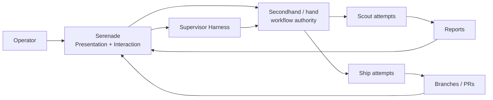

<p align="center">
  
</p>

<h1 align="center">Serenade</h1>

<p align="center"><strong>A control room for your AI software team.</strong></p>

<p align="center">
  <a href="LICENSE"></a>
  <a href="https://github.com/BigNeekode/Serenade/actions/workflows/ci.yml"></a>
  
  
</p>

Serenade is a free, local-first desktop GUI for [Secondhand (`hand`)](https://github.com/atqamz/hand), the multi-agent coding orchestrator. If you run several AI coding agents in parallel, `hand` orchestrates them; **Serenade makes the fleet visible, controllable, and steerable without keeping a pile of terminals open.**

> Serenade is the **Presentation + Interaction layer** above Hand. It does not reimplement orchestration, lifecycle, routing, session management, or worktree authority. `hand` remains the source of truth.



## Why Serenade?

Running a fleet of coding agents from a CLI is powerful, but operationally expensive. Serenade answers the questions you keep asking while several workers are active:

- **What are my agents doing right now?**
- **Which tasks are blocked, stale, or failed?**
- **What changed, and where is the worktree?**
- **What did the scout discover?**
- **What needs my attention?**

It also adds a **Supervisor chat** that can reason over fresh Hand-owned context, plan work, and propose tasks as approval cards. Reasoning goes through the Supervisor Harness; already-exact operator actions go directly through typed Hand operations instead of spending another LLM turn translating a button click.

## Features

### Fleet operations

| Area | What you get |
|---|---|
| **Overview** | Fleet health, live activity, project health, provider usage, failures, plus a clearly labeled legacy-derived Attention view |
| **Projects** | Registered repositories with a Kanban board, timeline, search, and filters |
| **Tasks** | Worker log stream, progress, worktree + Git status, commits, reports, retry / stop / instruct / promote actions, and progressive Task → Plan → Attempt lineage |
| **Agents** | Worker attempts with harness, model, observed activity state, lifecycle-aware status, and heartbeat warnings |
| **Worktrees** | Isolated checkouts per task with Git metadata; open in editor / file manager / terminal; confirmed cleanup |
| **Reports** | Markdown rendering of scout reports; create follow-up work; promote scouts to ship tasks |
| **Routes & providers** | Read-only view of Hand profiles/routes plus live worker counts |
| **Supervisor chat** | Qualified headless Supervisor Harness with project/fleet scope and one-click task approval cards |

On the current Hand 0.6 compatibility adapter, canonical Plan data does not exist. Serenade deliberately displays Plan as unavailable instead of manufacturing one from task/brief fields. Likewise, current Attention items are presentation-derived compatibility hints, **not** canonical Hand Attention.

### Built-in safety

- **Hand stays authoritative** — UI state, chat history, provider sessions, and local caches never become workflow truth.
- **Fail-closed version policy** — workflow mutations are enabled only for a Hand contract Serenade has explicitly qualified.
- **No arbitrary shell endpoint** — backend actions are fixed, typed operations rather than a generic command runner.
- **Destructive actions are confirmed** — teardown and worktree cleanup show what will happen before execution.
- **Human-gated dispatch** — the supervisor can propose work, but only the operator can approve a spawn.
- **Claims are not lifecycle** — a provider or WorkerReport saying `done` is not silently promoted into Attempt/Task completion.
- **Local-first application state** — Serenade has no hosted backend or telemetry service. Your configured AI harnesses may still communicate with their own model providers.

### Developer experience

- `Ctrl+K` command palette and global search.
- Resizable context panel for inspecting tasks without leaving the board.
- Shared polling cache to avoid spawning redundant `hand` processes.
- Browser mock mode for frontend work without a live fleet.
- Versioned Hand integration seams on both TypeScript and Rust sides.
- GitHub Actions CI for frontend typecheck/tests/build plus Rust check/tests.
- Dark developer-tool UI with dense operational views and monospace identifiers.

## End-user runtime requirements

For the packaged Serenade application you need:

| Tool | Why |
|---|---|
| Windows 10/11 (x86_64) | First supported platform for Quick Setup |
| [Git](https://git-scm.com) | Project clones and worktree metadata (detect-only; install manually if missing) |
| [Secondhand (`hand`)](https://github.com/atqamz/hand) **0.6.x** | Current verified fleet/task integration |
| [Treehouse](https://github.com/kunchenguid/treehouse) | Git worktree pool Hand 0.6 uses to isolate workers |
| [Herdr](https://github.com/herdrdev/herdr) | Terminal runtime Hand 0.6 uses to host worker panes |
| At least one Hand-supported coding harness | Worker execution through Hand profiles/routes |
| [OpenCode](https://opencode.ai) | **Optional** — only for Serenade Supervisor chat |

Serenade's Quick Setup can install a qualified `hand` 0.6.x binary into its own application-data directory, and install Treehouse + Herdr through their official bootstrap installers. None of these require Node.js, Rust, or manual `PATH` edits.

### Build-from-source requirements

| Tool | Why |
|---|---|
| [Node.js](https://nodejs.org) 22+ | Frontend toolchain |
| [Rust](https://rustup.rs) | Tauri desktop build |
| Tauri build dependencies | See [Tauri prerequisites](https://v2.tauri.app/start/prerequisites/) for your platform |

### Hand compatibility

Serenade intentionally distinguishes “detected” from “qualified.” A newer Hand executable is not automatically assumed to have the same mutation contract.

| Hand version | Current Serenade policy |
|---|---|
| **0.6.x** | Verified legacy adapter; workflow mutations enabled |
| **0.7.x** | Transition contract; workflow mutations blocked until explicitly qualified |
| **0.8.x+** | Detected as unadapted; workflow mutations blocked until the canonical adapter is implemented |
| Unknown / unparsable | Fail closed |

Diagnostics remain available where safe. Do not interpret this table as a promise that every read model from an unqualified newer Hand version can already be rendered correctly.

### Install Secondhand

**Quick Setup (recommended for packaged builds):** Serenade can download and install a qualified Hand 0.6.x Windows release asset automatically, verify its SHA-256 checksum, and place it in the managed tool directory. No global `PATH` change is required.

**Manual / existing environment:** Use Secondhand's documented bootstrap or manual release binary.

Linux / macOS:

```sh
curl -fsSL https://github.com/atqamz/hand/releases/latest/download/bootstrap.sh | sh
```

Windows PowerShell:

```powershell
irm https://github.com/atqamz/hand/releases/latest/download/bootstrap.ps1 | iex
```

Then verify the environment:

```sh
hand doctor
```

See the [Secondhand repository](https://github.com/atqamz/hand) for manual and platform-specific installation options.

## Quick Setup

On first launch Serenade opens a **Quick Setup** wizard if it has not been completed before:

1. **Welcome** — choose to let Serenade prepare tools or use an existing environment.
2. **Environment Check** — read-only scan for Git, Hand, Fleet, and Supervisor Harness.
3. **Fleet Location** — choose where your Fleet home lives (default: `%USERPROFILE%\Serenade\fleet`).
4. **Setup Plan** — preview what Serenade will do before any download or installation.
5. **Prepare Environment** — Serenade installs a qualified Hand 0.6.x release asset (checksum-verified), installs the Treehouse and Herdr runtime tools Hand 0.6 depends on, then initializes the Fleet through `hand init`.
6. **Supervisor (optional)** — detect or skip OpenCode setup.
7. **First Project** — register a remote Git repository by URL.
8. **Ready** — enter the main Serenade UI.

You can reopen the wizard or manage the environment later from **Settings → Environment**. The same read-only scan and repair actions are available there.

### Using an existing environment

If you already have Hand 0.6.x and a Fleet home, choose **Use existing environment** in the wizard or set the paths directly in **Settings → Fleet paths**:

- **Hand binary path** — an absolute path or a name resolvable on `PATH`.
- **Fleet path** — a directory already initialized with `hand init`.

Serenade will detect whether the configured Hand is managed, system, or custom and will not overwrite a healthy system/custom installation.

### Managed tool storage

Tools Serenade installs for you live under its local application-data directory (managed binaries are machine-local and do not roam):

```text
%LOCALAPPDATA%\app.serenade.desktop\Serenade\
├─ cache\         # downloads and staging
└─ tools\         # managed binaries
   └─ hand\0.6.0\hand.exe
```

Serenade-owned config (e.g. `serenade-config.json`) lives separately under the roaming application-data directory. Logs go under the local application-data directory as well.

Serenade never installs `latest` blindly. The qualified Hand version is pinned in the installer manifest and verified against the official release checksums before activation.

## Getting started

### 1. Clone and launch Serenade

```sh
git clone https://github.com/BigNeekode/Serenade.git
cd Serenade
npm install
npx tauri dev
```

For a production build:

```sh
npx tauri build
```

Tauri places release artifacts under `src-tauri/target/release/` and platform bundles under `src-tauri/target/release/bundle/` when bundle generation is available for the host platform.

On first launch, Serenade runs the **Quick Setup** wizard if the environment is not ready. You can also open it later from **Settings → Environment**.

### 2. Create or select a fleet home

A *fleet home* is the directory created by `hand init`. Serenade can initialize one from Quick Setup, or you can create it yourself:

```sh
hand init ~/secondhand-fleet
hand doctor
```

Then set that directory in **Serenade → Settings → Fleet paths** and save the configuration.

### 3. Register a project

Hand 0.6 registers remote Git repositories. From Quick Setup or the Projects page, add a Git repository URL:

```sh
hand project add https://github.com/you/your-repo
```

`hand project add` also accepts `git@…`, `ssh://…`, and `git://…` URLs. Creating a brand-new repository or adopting a local checkout (`hand project create` / local paths) are Hand 0.8 features not yet exposed by Serenade. To start a brand-new project, create the repository on your remote first, then register its URL here.

You can confirm the fleet configuration with:

```sh
hand config
```

### 4. Configure Hand profiles and routes

Hand 0.6.x does **not** use one global `hand config set harness ...` setting. Worker selection is expressed through **profiles** and **routes**.

The supported CLI shape is:

```sh
hand config profile set <profile-name> --harness <installed-harness> [--model <model>] [--effort <effort>]
hand config route set <scout|ship> <mechanical|standard|deep> <profile-name>
hand config
```

Profile names, models, and routing policy are operator-owned choices. A normal Secondhand supervising session can inspect `hand config`, ask only for unresolved policy choices, and persist the selected profiles/routes for you.

Serenade reads that configuration through its Hand compatibility adapter; it does not invent a replacement routing policy.

### 5. Create your first task

There are two paths:

- **Direct** — click **New Task**, select a project, enter the task brief, then choose **scout** (investigation/report) or **ship** (implementation). Serenade writes the brief and dispatches the worker through the qualified Hand mutation adapter.
- **Supervisor** — open **Supervisor**, describe the outcome you want, and let the supervisor propose tasks. Approved cards become exact typed task-create actions; approval does not spend another Supervisor/LLM turn.

From there you can watch the board, inspect logs, send mid-flight instructions, review the worktree, retry failed attempts, promote scout work, and clean up completed tasks.

## Supervisor chat

Serenade's currently qualified Supervisor Harness is **OpenCode running headlessly**.

The Supervisor runtime is deliberately separate from worker routing and from canonical Fleet state:

- Worker Attempts may use any installed harness that Hand supports and that you configure through profiles/routes.
- Supervisor provider/session IDs are ephemeral runtime mechanics, not Fleet workflow entities.
- Serenade chat history is UX state, not workflow truth.
- Every reasoning turn is instructed to refresh Hand-owned context before reasoning or acting.
- On verified Hand 0.6, Serenade retains a `hand session start` compatibility bootstrap/fallback because `hand orient` is not part of that legacy contract.
- **Serenade Supervisor chat currently requires `opencode` on `PATH`.** Other Supervisor Harnesses are not exposed until their headless/session/resume semantics are explicitly qualified.

If OpenCode is missing, the rest of Serenade remains usable; only Supervisor chat is unavailable.

## How it works

```text
┌────────────────────────────── Serenade ──────────────────────────────┐
│                                                                      │
│  React presentation                                                  │
│      │                                                               │
│      ├─ reads / local tooling ───────────────→ SerenadeApi           │
│      │                                                               │
│      └─ operator workflow intent                                     │
│             │                                                        │
│             ▼                                                        │
│      InteractionGateway                                              │
│       ├─ reasoning-required ─────────→ Supervisor Harness            │
│       └─ exact typed action ─────────┐                               │
│                                      │                               │
│                         TauriSerenadeApi / Tauri commands             │
│                                      │                               │
│                    compatibility + mutation guards                   │
│                                      │                               │
│                         HandLegacyGateway (0.6)                      │
│                                      │                               │
│                HandRunner · fleet files · Git/local adapters         │
└──────────────────────────────────────┼───────────────────────────────┘
                                       │
                              Secondhand / hand
                                       │
                    canonical fleet/task/attempt workflow
```

Current 0.6 integration still uses Hand's legacy CLI/files underneath the gateway. The boundary exists so a future released `HandV08Gateway` can consume canonical Hand 0.8 projections/actions without rewriting the React presentation layer.

Key principles:

- **`hand` is the source of truth.** Serenade asks the Hand gateway for semantic reads and maps legacy results into presentation models.
- **Reasoning and exact actions are different paths.** Free-form operator intent goes to the Supervisor; deterministic button actions go directly through typed operations.
- **Mutations are real Hand operations and fail closed on unqualified contracts.**
- **The frontend never needs CLI syntax.** Tauri exposes typed application commands rather than a generic shell bridge.
- **Presentation state is disposable.** Restarting the UI or Supervisor must lose zero canonical Fleet truth.
- **Mock mode is built in.** `npm run dev` runs the frontend against a rich in-memory fleet without requiring a live Secondhand installation.

## Repository layout

```text
src/                  React frontend
├─ app/               bootstrap, router, providers
├─ components/        design system, app shell, common UI
├─ features/          overview, supervisor, projects, tasks, agents, worktrees,
│                     reports, routes, settings, setup
├─ hooks/             query hooks, polling, shared interaction hook
├─ lib/api/           SerenadeApi interface + Mock and Tauri implementations
├─ lib/hand/          frontend Hand version/compatibility gateway
├─ lib/interaction/   reasoning vs exact-action boundary
├─ state/             UI-only state
└─ types/             Serenade presentation/domain model

src-tauri/src/        Rust backend
├─ lib.rs             Tauri commands and application integration
├─ hand/
│  ├─ gateway.rs      legacy semantic read boundary / Supervisor fallback
│  ├─ compatibility.rs Hand version qualification policy
│  ├─ process.rs      fixed-argument Hand runner, HAND_HOME, timeouts, guards
│  ├─ model.rs        legacy Hand JSON models
│  └─ toon.rs         legacy Hand TOON parsing
├─ supervisor.rs      qualified headless Supervisor Harness runtime
├─ adapter.rs         legacy Hand observations/lifecycle → presentation mapping
├─ fleet_files.rs     briefs, reports, status streams, event log
├─ environment.rs     read-only environment inspector (Git/Hand/Fleet/Supervisor)
├─ fleet.rs           Fleet destination validation and safe initialization
├─ installer.rs       managed Hand installer provider (Windows MVP)
├─ git.rs, local.rs   Git metadata and local editor/folder/terminal launching
└─ config.rs, error.rs, domain.rs

docs/                 product design, architecture, implementation plan,
                      Hand integration notes, backlog, and 0.8 alignment tracker
```

## Development

```sh
npm ci                             # reproducible frontend install
npm run typecheck                  # TypeScript
npm run test                       # Vitest + React Testing Library
npm run build                      # production frontend build
npm run lint                       # ESLint
npx tauri dev                      # full desktop app against a real fleet
cargo check --locked --manifest-path src-tauri/Cargo.toml
cargo test --locked --manifest-path src-tauri/Cargo.toml
```

The same typecheck/test/build and Rust check/test paths run in GitHub Actions CI.

The `docs/` directory contains the deeper engineering material:

- [`docs/design.md`](docs/design.md) — product and UX design.
- [`docs/architecture.md`](docs/architecture.md) — system architecture and safety model.
- [`docs/implementation-plan.md`](docs/implementation-plan.md) — milestone plan.
- [`docs/hand-integration-notes.md`](docs/hand-integration-notes.md) — verified legacy Hand CLI/runtime contract.
- [`docs/hand-0.8-roadmap.md`](docs/hand-0.8-roadmap.md) — living Hand 0.8 alignment/progression tracker.
- [`docs/tasks.md`](docs/tasks.md) — implementation backlog and status.

## Troubleshooting

### Rerun Quick Setup or repair the environment

Open **Settings → Environment** to rescan, install/reinstall managed Hand, set a custom Hand path, and check Fleet health. If the environment becomes unhealthy after setup, the same page offers repair actions rather than requiring terminal commands.

The first-run wizard can be retriggered by clearing `setupCompleted` in Serenade's config file (`%LOCALAPPDATA%\Serenade\config\serenade-config.json`), but **Settings → Environment** is the normal place to manage tools after onboarding.

The following runtime notes apply to the currently verified Hand 0.6 stack.

### Worker spawn fails with `server_not_running`

The current Hand 0.6 runtime expects `herdr`. Start it and retry the task — either click **Start server** on the Herdr card in **Settings → Environment**, or run it in any terminal:

```sh
herdr
```

Keep the window open to watch workers run in their panes; `Ctrl+B Q` detaches and `herdr` reattaches.

### Worker spawn hangs at a `>>` prompt on Windows

Current Hand 0.6 worker panes require a POSIX-compatible shell. Configure Git Bash for herdr in `%APPDATA%\herdr\config.toml`:

```toml
[terminal]
default_shell = "C:\\Program Files\\Git\\bin\\bash.exe"
```

Then reload herdr:

```sh
herdr server reload-config
```

See [`docs/hand-integration-notes.md`](docs/hand-integration-notes.md) for the verified Windows notes.

### Claude worker pauses on a trust/security dialog

Claude Code can ask whether to allow external `CLAUDE.md` imports. Answer the prompt once in the current Hand worker pane, or route that work through another already-configured Hand profile.

### Supervisor chat says `opencode` is not found

Install OpenCode and ensure the `opencode` executable is on `PATH`. This requirement applies to Serenade's currently qualified Supervisor Harness, not to all worker routes.

### Task looks active after the coding agent finished

A provider finishing a turn or a WorkerReport claiming `done` is not the same thing as Hand completing an Attempt. Serenade deliberately keeps those facts separate. Inspect the Attempt/worktree/report state and perform the appropriate explicit action instead of assuming provider `done` means lifecycle completion.

### Serenade says workflow mutations are blocked

Open **Settings → Diagnostics** and check the detected Hand contract. Serenade intentionally fails closed when the installed Hand version has not been explicitly qualified for mutations.

## Status and roadmap

**MVP complete and live-verified against Hand 0.6.0 on Windows.** The current `main` branch also includes the Hand 0.8 alignment/stabilization work: versioned gateway boundaries, fail-closed mutation compatibility, Supervisor/runtime separation, lifecycle-safe `done` handling, progressive Task → Plan → Attempt presentation, and provenance-labeled Attention compatibility UI.

The goal is **not** to guess Hand 0.8 ahead of upstream. Canonical `FleetSnapshot`, `Attention`, `SupervisorOrientation`, Plan/currentness contracts, WorkerInput/WorkerWake, and native WorktreeBinding integration remain intentionally blocked until their released Hand contracts stabilize.

Safe next areas:

- Expand full Task detail so report Claim, provider activity, and Attempt lifecycle are separately named facts.
- Live-test the actual OpenCode Supervisor runtime contract against the verified Hand 0.6 environment.
- Qualify additional Supervisor Harness adapters only when their headless/session/resume semantics are known.
- Installer bundles and finalized application branding/icons.
- Streaming Supervisor replies.
- Token and cost analytics where the underlying harness data is available.

See [`docs/hand-0.8-roadmap.md`](docs/hand-0.8-roadmap.md) for Hand alignment progress and [`docs/tasks.md`](docs/tasks.md) for the broader backlog.

## Contributing

Issues and pull requests are welcome. For implementation work, start with the architecture, verified Hand integration notes, and the 0.8 alignment roadmap. Preserve the core invariants: Hand remains the source of truth, presentation state stays disposable, lifecycle facts are not inferred from provider claims, destructive actions stay explicit, unqualified Hand contracts fail closed, and Serenade does not expose arbitrary shell execution.

## Acknowledgments

- [Secondhand / `hand`](https://github.com/atqamz/hand) — the orchestration engine Serenade presents and interacts with.
- [treehouse](https://github.com/kunchenguid/treehouse) and [herdr](https://herdr.dev) — dependencies used by the currently verified Hand 0.6 runtime; Serenade intentionally does not make them part of its long-term domain model.
- [Tauri](https://tauri.app), React, Tailwind CSS, TanStack Query, and the broader open-source ecosystem behind the desktop UI.

## License

Licensed under the [MIT License](LICENSE).
